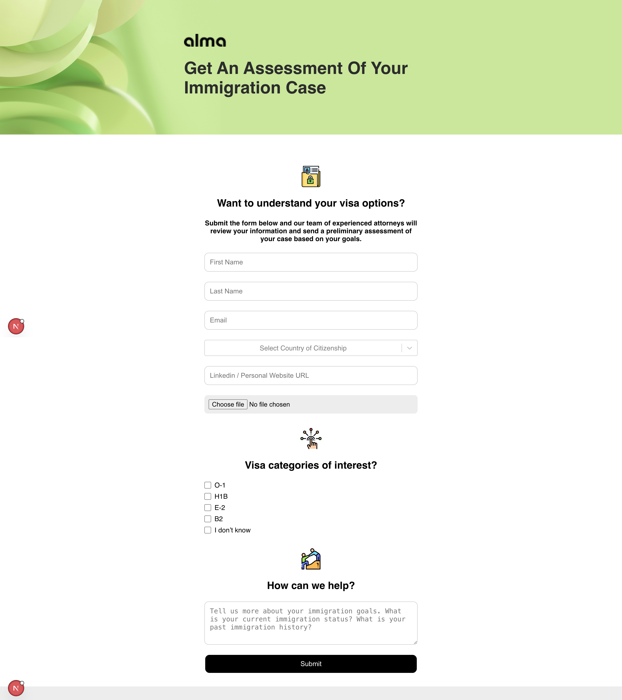

# Alma Immigration Leads Application

This project is a Next.js application that I built to support the creation, retrieval, and updating of immigration leads. It features a public lead form for prospects and an internal admin interface for managing leads, including authentication, sorting, filtering, and state transitions.

## Table of Contents

- [Project Structure](#project-structure)
- [How to Run the Application](#how-to-run-the-application)
- [Running Tests](#running-tests)
- [System Design](#system-design)
- [Modularity](#modularity)
- [Finished Tasks](#finished-tasks)
- [Screenshots](#screenshots)
- [Technologies Used](#technologies-used)
- [Additional Notes](#additional-notes)

## Project Structure

The project is organized using Next.js 13’s App Router with a modular structure. Key directories include:

- **app/**  
  Contains the application pages and layouts.

  - `page.tsx`: Public Lead Form page.
  - `confirmation.tsx`: Confirmation page after successful submission.
  - `admin/`: Directory for the internal admin UI (e.g., lead list page).
  - `api/`: API routes for leads and authentication.
    - `api/leads/`: Contains endpoints to GET, POST, and PATCH leads.
    - `api/auth/`: Contains the authentication endpoint.
  - `styles/`: Global and component-specific CSS modules.

- **components/**  
  Contains reusable UI components:

  - `LeadForm.tsx`: Public lead form component.
  - `Sidebar.tsx`: Sidebar component for the admin UI.
  - `Filters.tsx`: Component to handle filtering and search in the admin UI.
  - `LeadTable.tsx`: Table component to display the list of leads.

- **redux/**  
  Contains Redux store configuration and slices:

  - `store.ts`: Redux store setup using Redux Toolkit.
  - `slices/leadSlice.ts`: Redux slice to manage the leads state.

- \***\*tests**/\*\*  
  Contains unit tests for key components using Jest and React Testing Library.

- **public/**  
  Contains static assets including images (e.g., logos, icons) and uploaded resumes.

## How to Run the Application

1. **Clone the Repository**

   ```bash
   git clone https://github.com/snigdha2210/alma-hiring-test
   cd alma-hiring-test
   ```

2. **Install Dependencies**

   ```bash
   npm install
   ```

3. **Run the Development Server**

   ```bash
   npm run dev
   ```

   The application will be available at [http://localhost:3000](http://localhost:3000).

4. **Build and Start for Production**

   To build the application for production:

   ```bash
   npm run build
   npm run start
   ```

## Running Tests

This project uses Jest and React Testing Library for unit testing.

1. **Install Testing Dependencies**

   Make sure you have installed:

   ```bash
   npm install --save-dev jest @testing-library/react @testing-library/jest-dom jest-fetch-mock ts-jest
   ```

2. **Run Tests**

   Use the following command:

   ```bash
   npm test
   ```

   This will run all test suites and provide output for passed/failed tests.

## System Design

### Public Lead Form

- **User Interface:**  
  A user-friendly form that collects essential data: first name, last name, email, LinkedIn URL, visa interests (via checkboxes), resume upload, and additional information.
- **File Upload:**  
  The resume/CV is uploaded using multipart/form-data and stored (for demo purposes) in a local directory.
- **Form Validation:**  
  Both client-side and optional server-side validations ensure that required fields are filled with the correct format.

### Internal Leads List UI

- **Authentication:**  
  The admin interface is protected by an inline authentication modal. Users enter valid credentials to gain access. (admin,password)
- **Sorting, Filtering, Searching:**  
  The admin can search for any particular person, filter through status and sort all columns.
- **State Management:**  
  Leads are managed in a Redux store. When a lead is submitted, it is stored in memory (via API routes) and synchronized with Redux.
- **CRUD Functionality:**  
  The admin interface displays all submitted leads in a sortable, filterable table. Admins can update the lead status from PENDING to REACHED_OUT.
- **Responsive Design:**  
  The admin page features a collapsible sidebar for small screens, and the table container is scrollable on narrow viewports.

## Modularity

The project is designed with modularity in mind:

- **Component-Based Architecture:**  
  Each UI section (LeadForm, Sidebar, Filters, LeadTable) is built as an independent, reusable component.
- **Redux State Management:**  
  The state is centralized in a Redux store using Redux Toolkit, making it easy to scale and maintain.
- **API Routes:**  
  Backend functionality is implemented using Next.js API routes. The API endpoints for leads and authentication are modular and can be easily replaced with persistent storage (e.g., a database) in production.
- **Testing:**  
  Tests are modularized by component, making it easier to identify issues and maintain the code.

## Finished Tasks

- **Public Lead Form:**  
  Implemented a fully functional lead form with file uploads and validation.
- **Confirmation Page:**  
  Display a confirmation message upon successful submission.
- **Internal Leads List:**  
  Developed a responsive admin interface with sorting, filtering, and inline authentication.
- **Redux Integration:**  
  Used Redux Toolkit to manage and share lead data across components.
- **API Routes:**  
  Implemented Next.js API routes to mock backend operations.
- **Responsiveness:**  
  Ensured that the application works well on various screen sizes, with a collapsible sidebar and scrollable tables.
- **Testing:**  
  Wrote unit tests for key components using Jest and React Testing Library.

## Screenshots

Below are some screenshots that illustrate the main screens of the application:

- **Public Lead Form:**  
  

- **Confirmation Page:**  
  

- **Lead List Page:**  
  

- **Lead List Page With AuthGuard:**  
  

_(Place your screenshot images in the `screenshots/` folder and update the paths if necessary.)_

## Technologies Used

- **Next.js:**  
  For server-side rendering and building API routes.
- **React:**  
  For building the user interface.
- **TypeScript:**  
  For type safety and improved developer experience.
- **Redux Toolkit & React-Redux:**  
  For state management.
- **CSS Modules:**  
  For styling components.
- **Jest & React Testing Library:**  
  For unit and integration testing.
- **jest-fetch-mock:**  
  For mocking fetch calls in tests.
- **Other Libraries:**  
  Additional libraries such as react-icons for icons and react-select-country-list.

## Additional Notes

- **Data Persistence:**  
  The in-memory store for leads is intended for demonstration and development. For production, consider using a persistent data store (e.g., MongoDB, PostgreSQL).
- **Authentication:**  
  The inline authentication mechanism is a mock implementation. For a production application, implement a robust authentication solution.
- **Scalability:**  
  The modular architecture and centralized state management (via Redux) allow easy scaling and maintenance of the application.
- **Documentation:**  
  This README, along with inline code comments, offers insights into the system design and architecture.

---
